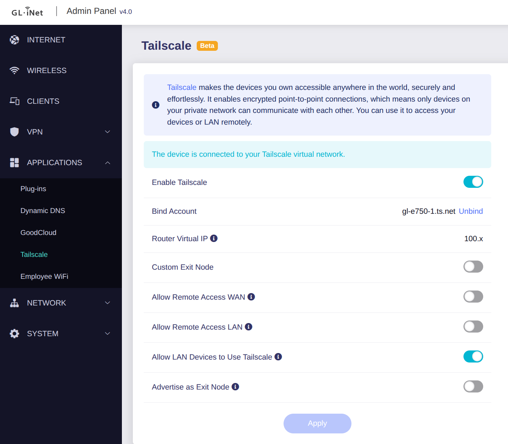

# glinet-tailscale-feed

**Full install + device→arch guide: [INSTALL.md](INSTALL.md)**

Self-hosted opkg feed that restores **Tailscale + the GL.iNet admin-UI Tailscale panel** on
GL.iNet **GL-E750 / GL-E750V2 (Mudi / Mudi V2)** and other `ath79 / mips_24kc` (QCA95xx) routers,
after GL.iNet stopped shipping it.

Built for **seven** GL architectures (see the table below); GL-E750/E750V2 = QCA9533 / ath79 / `mips_24kc`.



## Packages

| Package | Version | Download | Purpose |
|---|---|---|---|
| `tailscale` | 1.98.8-2 | ~8.2MB | Current tailscaled+CLI, one binary (soft-float mips). Full features. |
| `tailscale-micro` | 1.98.8-micro2 | ~5.6MB | Size-minimized (no netstack/DNS). Conflicts with `tailscale`. |
| `gl-sdk4-tailscale` | git-2025.115 | ~7KB | GL backend: init, rpcd handler, firewall/hotplug, `gl_tailscale`. |
| `gl-sdk4-ui-tailscaleview` | git-2025.244 | ~18KB | The admin-UI Tailscale panel (menu + web view + i18n). |

The two `gl-sdk4-*` packages were extracted from GL's own XE3000 firmware image (they are
architecture-independent shell/Lua/JS — no compiled code) and repackaged for `mips_24kc`.
The `tailscale` binary is cross-compiled from upstream source (`GOARCH=mips GOMIPS=softfloat`,
`ts_include_cli`, `-s -w`), the same approach as GL's `small-tailscale` branch.

## Architectures

GL.iNet dropped Tailscale across several device families. This feed rebuilds it for all of them.
Find your device's arch with `opkg print-architecture`, then use the matching feed path:

| Feed path (arch) | GL devices (examples) |
|---|---|
| `mips_24kc` | ath79 / QCA95xx — GL-E750, E750V2, AR750, MT300N |
| `mipsel_24kc` | ramips mt7621/mt7628 — MT1300 Beryl, MT300N-V2, SFT1200 |
| `arm_cortex-a7` / `arm_cortex-a7_neon-vfpv4` | ipq40xx — AR750S Slate, B1300, A1300 |
| `arm_cortex-a15_neon-vfpv4` | ipq806x — B2200 |
| `arm_cortex-a9_vfpv3-d16` | mvebu (armada-38x) |
| `aarch64_cortex-a53` | mt7981 / ipq807x / ipq60xx — Flint, Spitz AX, XE3000 |

Every arch feed ships the same GL GUI panel (`gl-sdk4-*`, `Architecture: all`). `tailscale-micro`
(size-minimized) is provided for `mips_24kc`; ask if you want it built for another arch.

## Install (any device)

Easiest — the script auto-detects arch, checks free space, and picks full vs `-micro`:

```sh
# inspect only, changes nothing:
curl -fsSL https://digitalcybersoft.github.io/glinet-tailscale-feed/setup.sh | sh -s -- --dry-run
# install:
curl -fsSL https://digitalcybersoft.github.io/glinet-tailscale-feed/setup.sh | sh
```

Piping is safe: the script never `read`s from a non-tty, so it won't hang or eat stdin.
Download it first only if you want the interactive "flash is tight, use -micro?" prompt during
a real install (piped, that question auto-answers "keep full"):
```sh
curl -fsSL https://digitalcybersoft.github.io/glinet-tailscale-feed/setup.sh -o /tmp/setup.sh
sh /tmp/setup.sh --dry-run     # or --full / --micro to force a tier
sh /tmp/setup.sh
```

Manual equivalent:

```sh
ARCH=$(opkg print-architecture | awk '$1=="arch" && $2!="all" && $2!="noarch"{print $3, $2}' | sort -rn | awk 'NR==1{print $2}')
echo "src/gz glits https://digitalcybersoft.github.io/glinet-tailscale-feed/$ARCH" >> /etc/opkg/customfeeds.conf
opkg update  --force-signature
opkg install --force-signature tailscale gl-sdk4-tailscale gl-sdk4-ui-tailscaleview
```

Panel appears under **Applications -> Tailscale** in the GL admin UI (postinst reloads rpcd/nginx;
refresh or reboot if needed). If opkg rejects the arch, add `--force-architecture`.

### The `--force-signature` flag is required (unsigned feed)
GL firmware ships opkg with `check_signature` enabled. This feed is **unsigned**, so:
- `opkg update` **without** `--force-signature` downloads then **deletes** this feed's package
  list (it has no `Packages.sig`). Always update with `opkg update --force-signature`.
- The installer drops a helper: run **`glits-update`** instead of plain `opkg update` to refresh
  and keep this feed, then `opkg install --force-signature tailscale` to pull a newer build.
- Already-installed packages keep working after a plain `opkg update`; only the update list is pruned.
- `--nocheck-signature` does **not** exist in OpenWrt/GL opkg — use `--force-signature`.


### Low flash (GL-E750 ~16MB internal)
Use `tailscale-micro` instead of `tailscale`, and/or install to attached storage
(`opkg install -d sd ...` with an `sd` dest in `/etc/opkg.conf`).

## Verified / not verified
- Verified: binaries are ELF32 big-endian MIPS32 **soft-float**, run under qemu (`tailscale version`,
  `up --help`); GUI packages contain no ELF; e750 firmware 4.8.5 has the `oui-httpd`/`menu.d`/`libuci-lua`/
  `coreutils-timeout` framework the panel needs; served files match their index SHA256.
- NOT verified on real hardware. The GUI view JS is GL 4.8.3-built; the e750 should be on 4.8.x.
  `tailscale-micro` omits netstack/DNS; pair the GUI with the full `tailscale` unless flash forces micro.

## Known deviation
Stock Tailscale firewall mark (`0x80000`)/route table. GL's e750v2 build remaps these; not applied here.
